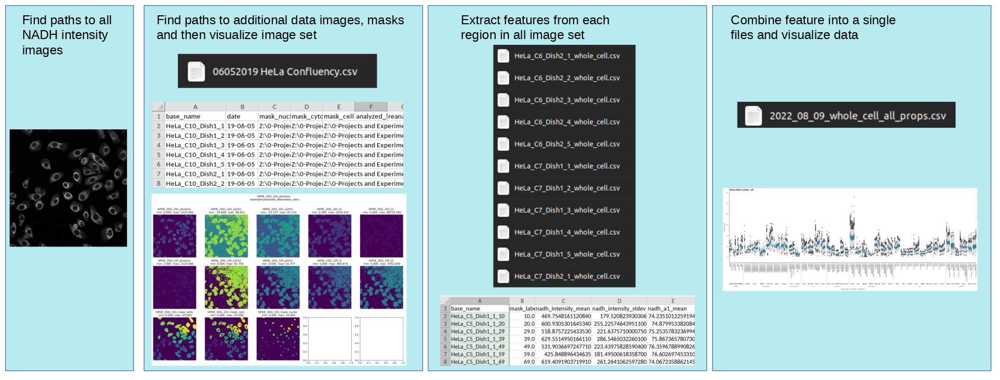
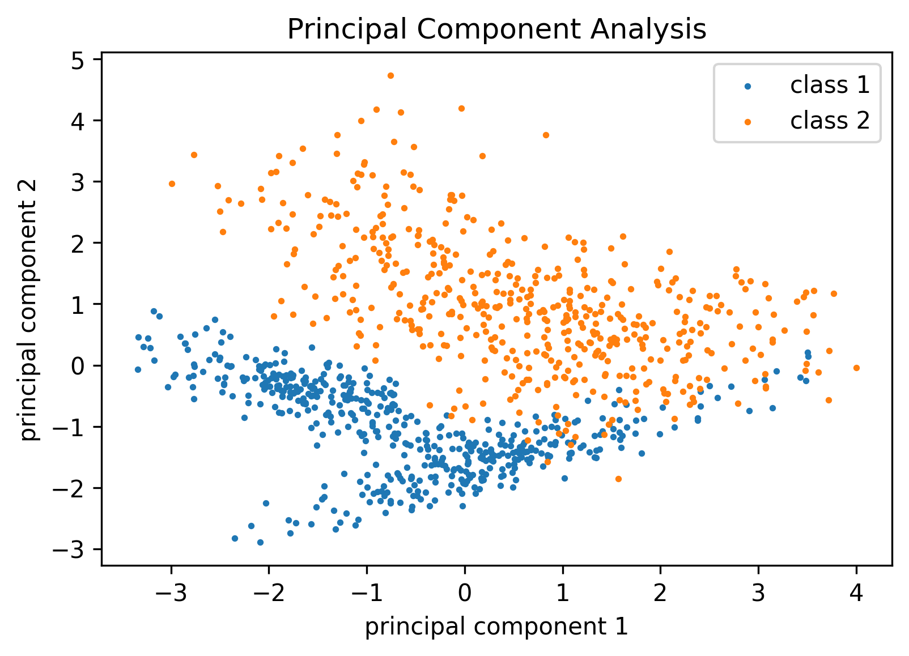
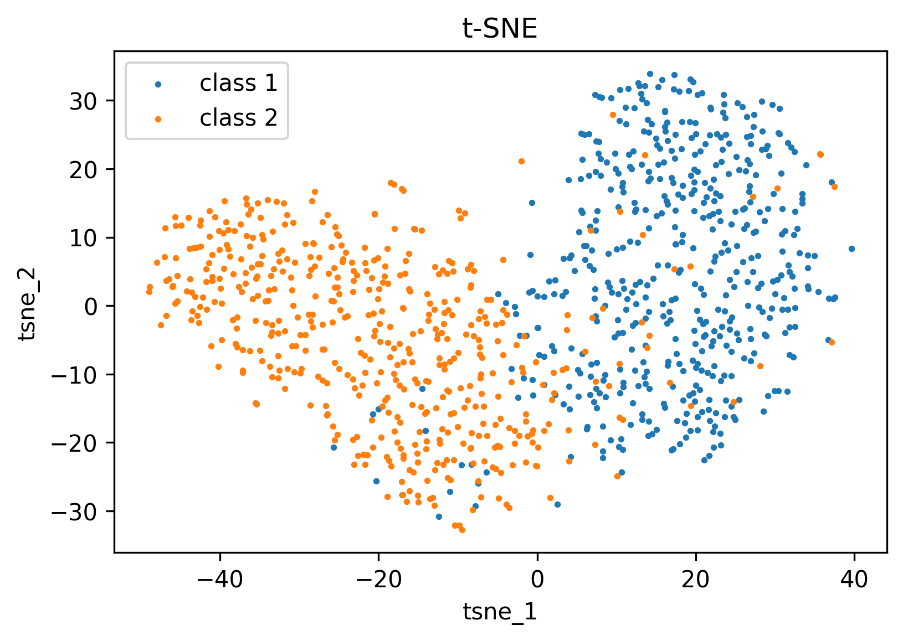
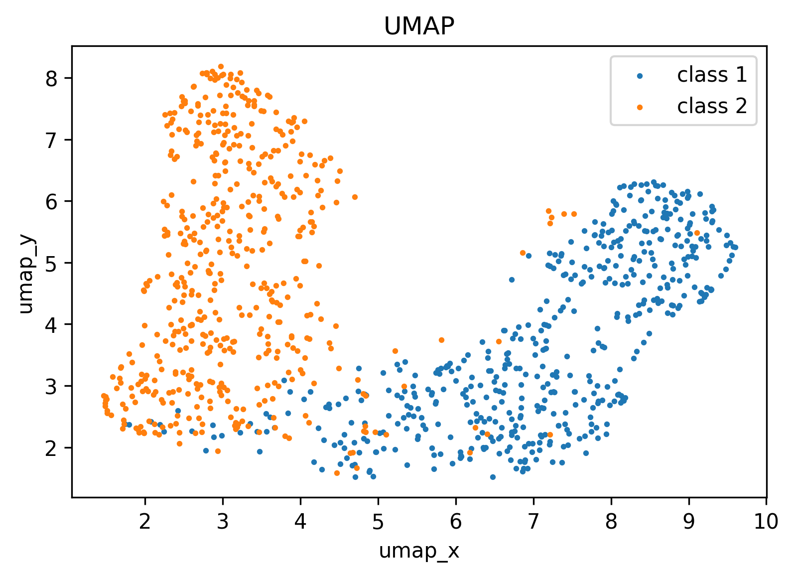
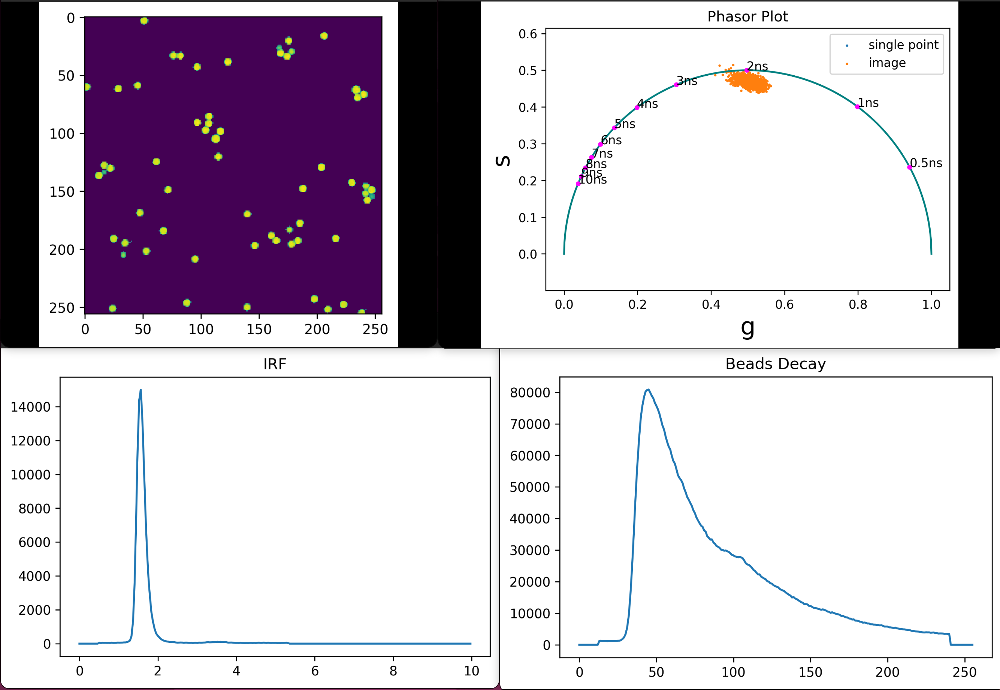

.. cell_analysis_tools documentation master file, created by
   sphinx-quickstart on Fri Aug 20 13:26:16 2021.
   You can adapt this file completely to your liking, but it should at least
   contain the root `toctree` directive.

Cell Analysis Tools
####################

This library was developed for the Skala Lab at the Morgridge Institute for Reserach / University of Wisconsin-Madison to 
simplify single cell analysis of images. It contains many relevant functions used for  pre-processing, processing 
analyzing, loading and summarizing images.  

Single cell feature extraction code and example
=================================================

* The included single cell feature extraction example can be modified to 
    * Load your fluorescence images and masks
    * Visualize sets of images 
    * Extract features by iterating over very single region of interest
    * Finally aggregate features into a single CSV file for further data analysis

        

    

Feature reduction example
===============================

* PCA

    

Dimensionality reduction example
=================================

* t-SNE

* UMAP

Basic phasor plotting functions
===============================

* Functions for transforming a lifetime decay into a phasor plot are included in the `flim` namespace

Image Processing 
=================
* Removing Noise --> 
* 

 

Dependencies 
------------

    * numpy
    * tifffile
    * pathlib
    * read_roi
    * os
    * matplotlib
    * re
    * skimage
    * pandas

Installation
------------

    Available through pip
    
    .. code-block:: python
    
        pip install cell-analysis-tools

    You could also clone the repository and install it manually by
    * changing directories to the cloned repo directory
    
    .. code-block:: bash

        pip install -e .
    

Examples 
--------

This library also contains examples scripts for various single cell analysis tasks\:
    * Extracting features from fluorescence lifetime images 
    * RandomForest, Logistic Regression and Support Vector Machine classification
    * Generating UMAPs
    
    
    `Examples On Gihub <https://github.com/skalalab/cell-analysis-tools/tree/main/examples>`_

Cite 
-----

.. toctree::
   :maxdepth: 2
   :caption: Contents:

   rest_files/flim
   rest_files/image_processing
   rest_files/io
   rest_files/metrics
   rest_files/morphology
   rest_files/visualization

Indices and tables
==================

* :ref:`genindex`
* :ref:`modindex`
* :ref:`search`